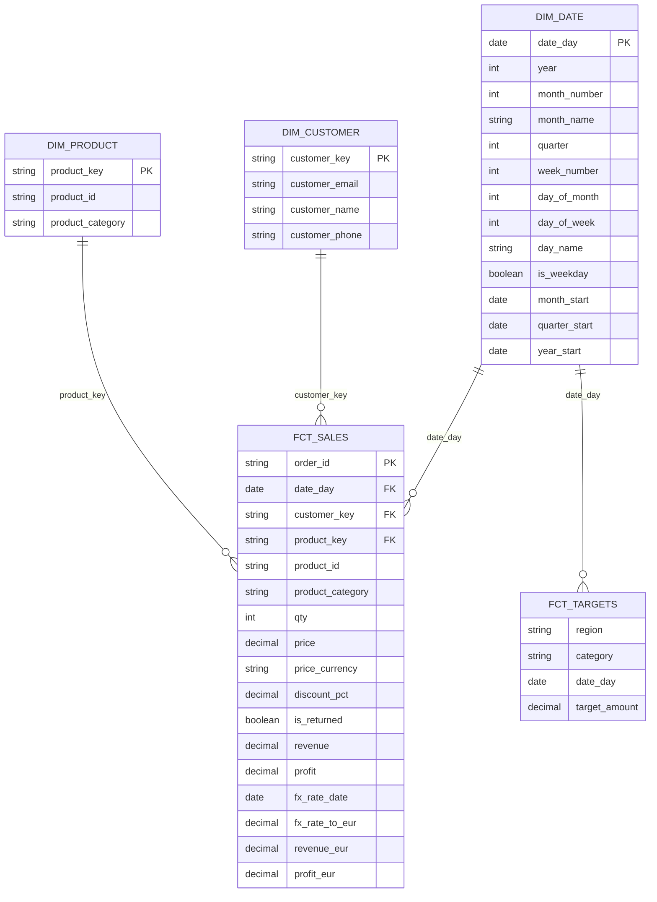

# Nova Retail — Gold Layer ERD

## Gold Data Model

The Gold layer follows a simple star-schema approach focused on sales performance and financial targets.



## Tables

### DIM_DATE

Calendar dimension covering the 2023 reporting period.

Used for:

- Year and month analysis
- Quarterly analysis
- Weekly analysis
- Daily sales trends
- MTD and YTD calculations
- Time-based filtering in Power BI

### DIM_CUSTOMER

Customer dimension built from the cleaned customer information contained in the sales source.

The customer key is generated using an MD5 hash of the normalized customer email.

### DIM_PRODUCT

Product dimension containing the product identifier and product category.

The product key is generated using an MD5 hash of the normalized product ID.

### FCT_SALES

Sales fact table containing one row per order.

It includes:

- Transaction date
- Customer and product keys
- Quantity
- Original price and currency
- Discount percentage
- Return indicator
- Revenue and profit
- ECB exchange-rate information
- Revenue and profit standardized to EUR

For transactions originally recorded in USD or GBP, the corresponding ECB reference exchange rate is used to calculate EUR values.

`revenue_eur` and `profit_eur` should be used for global financial analysis across currencies.

Transactions with missing transaction dates or unavailable FX rates may have NULL EUR-converted values.

### FCT_TARGETS

Monthly financial target fact table.

Its grain is:

**Region + Category + Month**

It contains:

- Region
- Product category
- Month
- Target amount

The source does not explicitly specify the currency of the target amounts, so the target currency should be treated as an assumption and documented accordingly.

## Relationships

- `DIM_DATE[date_day]` → `FCT_SALES[date_day]`
- `DIM_CUSTOMER[customer_key]` → `FCT_SALES[customer_key]`
- `DIM_PRODUCT[product_key]` → `FCT_SALES[product_key]`
- `DIM_DATE[date_day]` → `FCT_TARGETS[date_day]`

There is intentionally **no direct relationship between `FCT_SALES` and `FCT_TARGETS`**.

The sales source does not contain region information, while the target source does. Therefore, sales performance cannot be directly compared with regional targets without an additional regional mapping.

Similarly, product category filters apply to `FCT_SALES` through `DIM_PRODUCT`, but there is currently no shared category dimension connecting `DIM_PRODUCT` to `FCT_TARGETS`.

## Currency Conversion

The project uses ECB historical reference exchange rates to standardize USD and GBP transactions into EUR.

The FX staging model contains:

- `date_day`
- `currency`
- `rate_to_eur`

The ECB rates represent units of the original currency per EUR. Therefore:

```text
Revenue EUR = Original Revenue / FX Rate
```

EUR transactions use an exchange rate of `1`.

If no applicable FX rate is available, the EUR-converted measures remain NULL rather than being estimated or imputed.