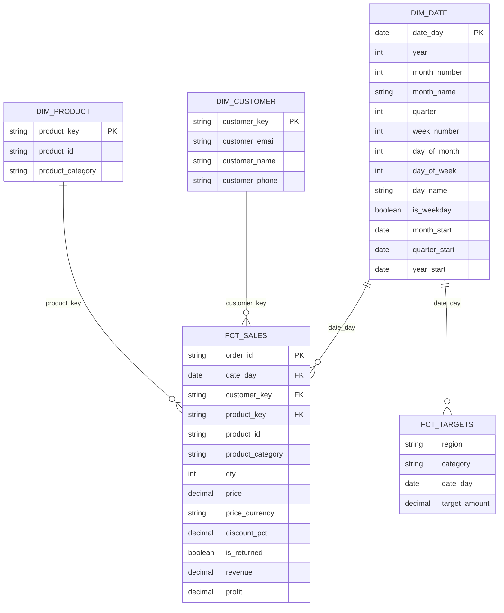

```mermaid
erDiagram

    DIM_DATE {
        date date_day PK
        int year
        int month_number
        string month_name
        int quarter
        int week_number
        int day_of_month
        int day_of_week
        string day_name
        boolean is_weekday
        date month_start
        date quarter_start
        date year_start
    }

    DIM_CUSTOMER {
        string customer_key PK
        string customer_email
        string customer_name
        string customer_phone
    }

    DIM_PRODUCT {
        string product_key PK
        string product_id
        string product_category
    }

    FCT_SALES {
        string order_id PK
        date date_day FK
        string customer_key FK
        string product_key FK
        string product_id
        string product_category
        int qty
        decimal price
        string price_currency
        decimal discount_pct
        boolean is_returned
        decimal revenue
        decimal profit
    }

    FCT_TARGETS {
        string region
        string category
        date date_day
        decimal target_amount
    }

    DIM_DATE ||--o{ FCT_SALES : "date_day"
    DIM_CUSTOMER ||--o{ FCT_SALES : "customer_key"
    DIM_PRODUCT ||--o{ FCT_SALES : "product_key"
    DIM_DATE ||--o{ FCT_TARGETS : "date_day"
```